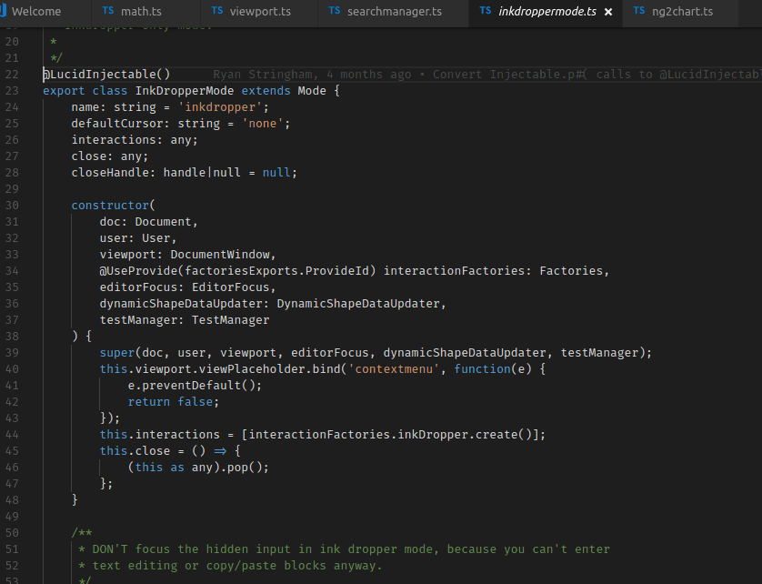

## Features

When copying and pasting code between files, this extension will attempt to add new imports the file you are pasting into. (disclaimer: it may add more imports than you are expecting).

## Known Issues

## Release Notes

### 0.0.1

Initial release of Copy With Imports